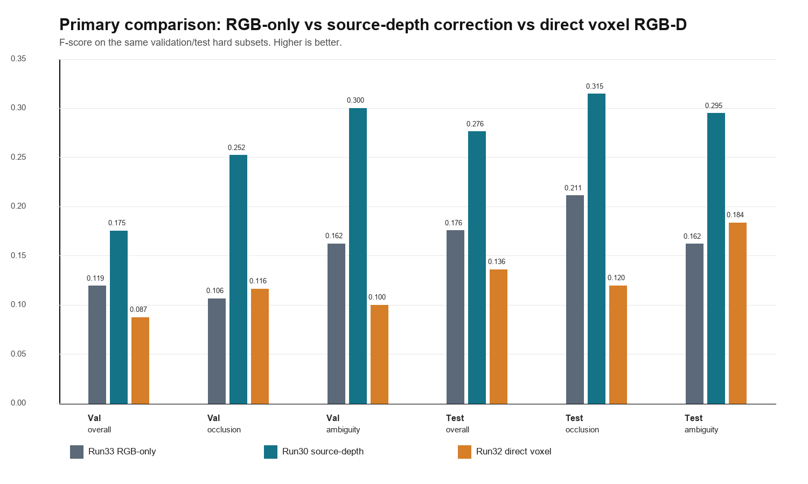
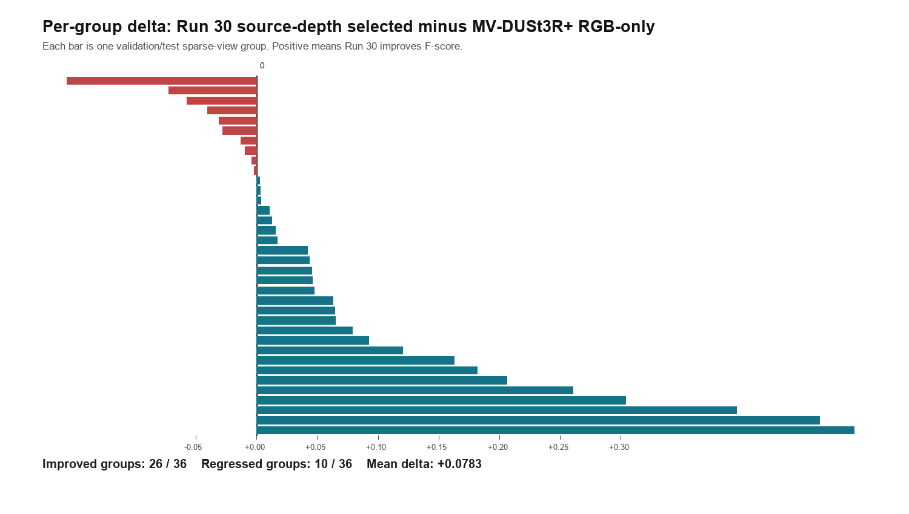
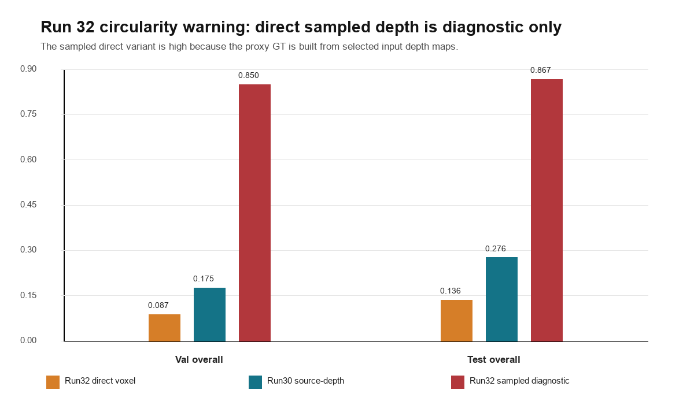

# Intuitive Output Comparison: Runs 30, 32, and 33

This note is a visual-first guide for comparing the three reference experiment families:

- **Run 33: MV-DUSt3R+ RGB-only baseline.** This is the clean backbone-only sparse RGB baseline, measured from the Run 30 candidate metrics without using source depth correction.
- **Run 30: RGB-D source-depth correction.** This is the validated true-depth reference: MV-DUSt3R+ candidate reconstruction plus input source depth, known camera poses/intrinsics, and source-ray correction.
- **Run 32: direct RGB-D backprojection diagnostic.** This tests whether source depth alone is enough. Its direct voxel reconstruction is the fair comparison; its sampled diagnostic is intentionally marked as circular/proxy evidence.

## Quick Visual Summary



Primary fair comparison:

| Subset | Run 33 RGB-only | Run 30 source-depth | Run 32 direct voxel |
|---|---:|---:|---:|
| Validation overall | 0.1194 | 0.1753 | 0.0874 |
| Validation occlusion | 0.1064 | 0.2522 | 0.1162 |
| Validation ambiguity | 0.1623 | 0.3000 | 0.0998 |
| Test overall | 0.1758 | 0.2764 | 0.1359 |
| Test occlusion | 0.2111 | 0.3146 | 0.1196 |
| Test ambiguity | 0.1621 | 0.2948 | 0.1837 |

Intuition:

- Run 33 tells us what the RGB-only MV-DUSt3R+ candidate cloud can do.
- Run 32 direct voxel tells us what raw RGB-D backprojection can do without MV-DUSt3R+ candidates.
- Run 30 is stronger than both in the fair primary setting, especially on occlusion and repeated/wrong-depth ambiguity.

## Per-Group Behavior



Run 30 improves 26 of 36 validation/test sparse-view groups over the RGB-only baseline. The mean per-group F-score delta is **+0.0783**. It still regresses on 10 groups, so the claim is not that source depth is universally better on every sparse group; the claim is that it gives a clear aggregate gain and much stronger hard-subset behavior.

Largest positive deltas:

| Split | Group | Run 33 RGB-only | Run 30 source-depth | Delta |
|---|---|---:|---:|---:|
| test | `scene0012_00_4_diversity_aware` | 0.0332 | 0.5253 | +0.4921 |
| val | `scene0009_01_4_hybrid` | 0.1203 | 0.5839 | +0.4636 |
| test | `scene0011_01_5_diversity_aware` | 0.0873 | 0.4824 | +0.3951 |
| test | `scene0013_00_4_diversity_aware` | 0.3205 | 0.6242 | +0.3038 |
| test | `scene0013_01_5_diversity_aware` | 0.1191 | 0.3795 | +0.2604 |

Largest negative deltas:

| Split | Group | Run 33 RGB-only | Run 30 source-depth | Delta |
|---|---|---:|---:|---:|
| test | `scene0012_00_5_diversity_aware` | 0.5670 | 0.4104 | -0.1566 |
| val | `scene0011_00_5_diversity_aware` | 0.1871 | 0.1147 | -0.0724 |
| val | `scene0011_00_4_diversity_aware` | 0.1562 | 0.0984 | -0.0577 |

The per-group CSV behind this figure is available at:

`assets/run30_vs_run33_group_deltas.csv`

## Run 32 Circularity Warning



Run 32 has two very different meanings:

| Split | Run 32 direct voxel | Run 30 source-depth | Run 32 sampled diagnostic |
|---|---:|---:|---:|
| Validation overall | 0.0874 | 0.1753 | 0.8500 |
| Test overall | 0.1359 | 0.2764 | 0.8666 |

Use **Run 32 direct voxel** as the fair baseline. Do **not** use the sampled diagnostic as a final result, because it is a proxy sampled from labeled/evaluated points and is useful mainly for checking whether the source-depth signal exists.

## Local Outputs To Open

Run 30 contains actual `.glb` reconstruction outputs. These are the most useful files for direct visual inspection:

| Purpose | Group | Local output |
|---|---|---|
| Largest Run 30 gain over RGB-only | `scene0012_00_4_diversity_aware` | `../../downloads/kaggle_run30_rgbd_source_depth_correction/outputs/run_30_rgbd_source_depth_correction/eval_groups/scene0012_00_4_diversity_aware/scene.glb` |
| Strong validation gain | `scene0009_01_4_hybrid` | `../../downloads/kaggle_run30_rgbd_source_depth_correction/outputs/run_30_rgbd_source_depth_correction/eval_groups/scene0009_01_4_hybrid/scene.glb` |
| Largest regression case | `scene0012_00_5_diversity_aware` | `../../downloads/kaggle_run30_rgbd_source_depth_correction/outputs/run_30_rgbd_source_depth_correction/eval_groups/scene0012_00_5_diversity_aware/scene.glb` |
| High occlusion and ambiguity | `scene0012_01_4_diversity_aware` | `../../downloads/kaggle_run30_rgbd_source_depth_correction/outputs/run_30_rgbd_source_depth_correction/eval_groups/scene0012_01_4_diversity_aware/scene.glb` |

Run 33 does not currently include separate `.glb` files, because it is a no-rerun metric extraction baseline from Run 30 candidate outputs. Run 32 outputs are not present in the local `downloads/` folder used for this comparison; its fair direct-voxel numbers are preserved in the Run 33 comparison tables.

## Run 34 Mesh Visualization

Run 34 exports two visualization levels for the same sparse-view groups:

- 3,500-point GLBs for a fair point-budget comparison.
- `dense_scene_exports/` that retain the camera and input-image geometry from
  the original MV-DUSt3R+ scene and replace its main cloud with dense RGB-only,
  Run 30 corrected, or direct RGB-D points.

The dense scene exports are the closest visual equivalent to file `00`. The
project also includes a reproducible Ball Pivoting post-process for users who
specifically need triangle surfaces:

```powershell
uv run --python 3.12 scripts/convert_run34_pointclouds_to_mesh.py
```

The resulting `*_mesh.glb` files are stored under
`meshes_ball_pivoting/<group>/`. Ball Pivoting was selected instead of Poisson
because it joins nearby samples while preserving unsupported holes. The mesh is
only a visual surface over the existing points: it is not a new method, does
not improve the reconstruction, and must not replace the point-cloud metrics.

## Run 34 Normalized Metrics

Run 34 also reports `normalized_distance` and
`dac_at_0_2_normalized` for the three matched 3,500-point outputs. Prediction
and proxy GT are independently zero-centered and divided by their RMS radius.

- `normalized_distance`: symmetric nearest-neighbor distance between the two
  normalized clouds; lower is better.
- `dac_at_0_2_normalized`: fraction of normalized prediction points within
  `0.2` of the normalized proxy GT; higher is better.

The aggregate values are written to `normalized_metric_summary.csv`. They are
auxiliary paper-style shape metrics, not a replacement for F-score/Chamfer and
not an independent official-mesh evaluation.

Verified Run 34 means over the three selected groups:

| Method | Mean normalized distance | Mean DAc@0.2 normalized |
| --- | ---: | ---: |
| Run 30 RGB-D selected | **0.0515** | **0.9841** |
| Run 32 direct RGB-D | 0.0926 | 0.8617 |
| Run 33 RGB-only all candidates | 0.1308 | 0.7967 |

The downloaded result is
`../../downloads/kaggle_run34_qualitative_3d_exports_v4/outputs/run_34_qualitative_3d_exports/normalized_metric_summary.csv`.

## How To Read The Three Experiment Types

**Run 33 / RGB-only**
This answers: "If we keep the final evaluation setup but remove RGB-D source-depth correction, how far does MV-DUSt3R+ alone get?" It is the best clean RGB-only reference, not the final method.

**Run 30 / RGB-D source-depth correction**
This answers: "If sparse RGB candidates are available and the input also provides source depth plus known calibration, can source-ray correction improve the final cloud?" Yes, especially on the hard occlusion and repeated/wrong-depth groups.

**Run 32 / direct source-depth**
This answers: "Can raw source depth alone replace MV-DUSt3R+ candidate reconstruction?" In the fair direct-voxel setting, no: it underperforms Run 30. This supports the combined method rather than a depth-only explanation.

## What This Does Not Claim

- It does not claim RGB-only solved occlusion.
- It does not claim RGB-only solved repeated/wrong-depth ambiguity.
- It does not claim Run 30 is better on every single sparse-view group.
- It does not claim full ScanNet++ or official benchmark generality.
