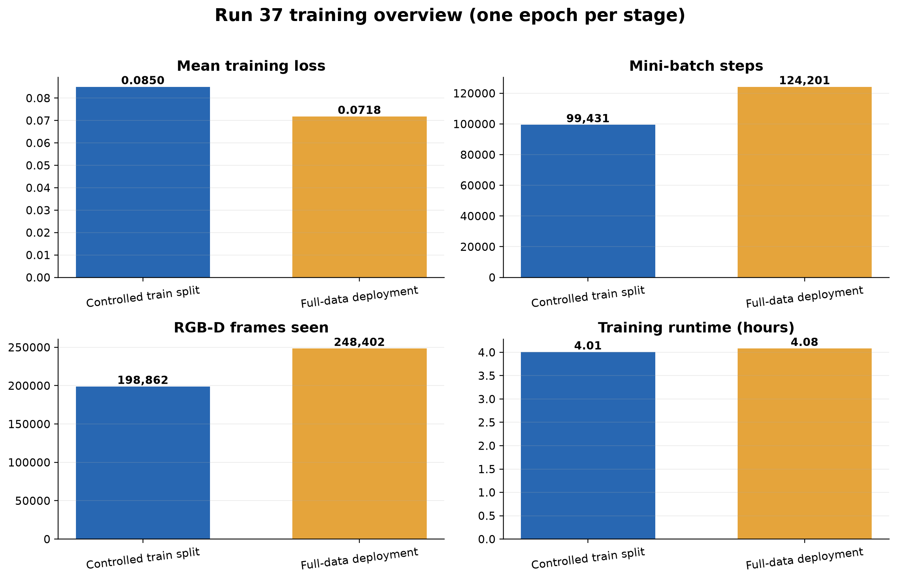
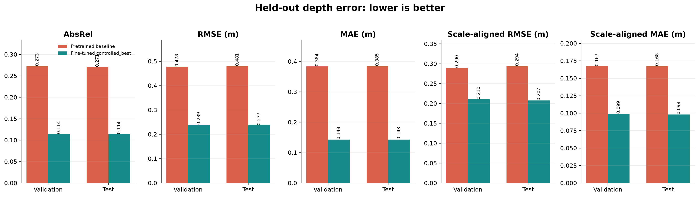
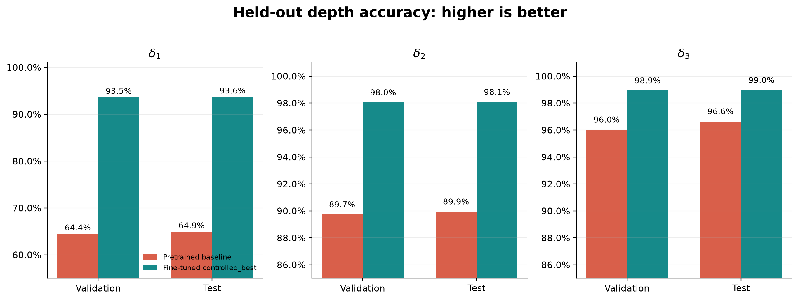
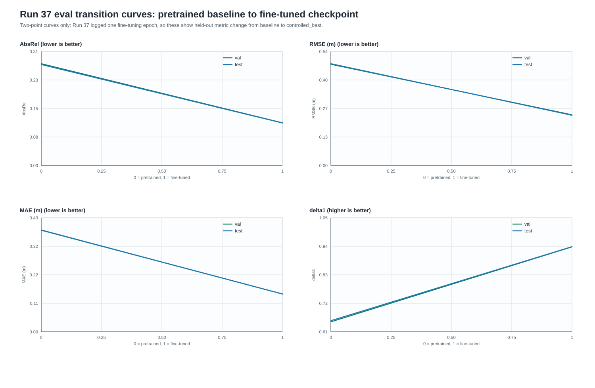
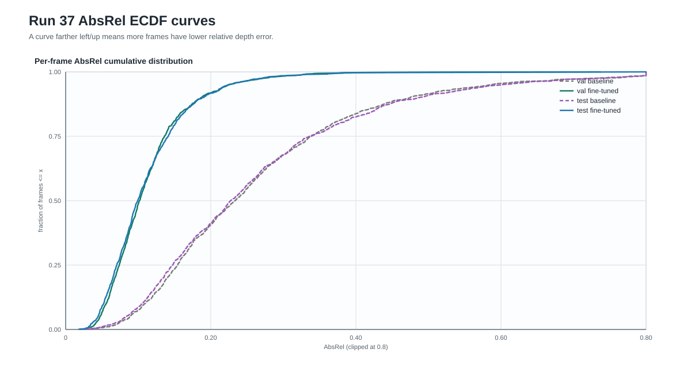
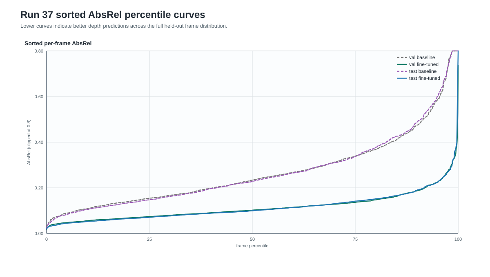
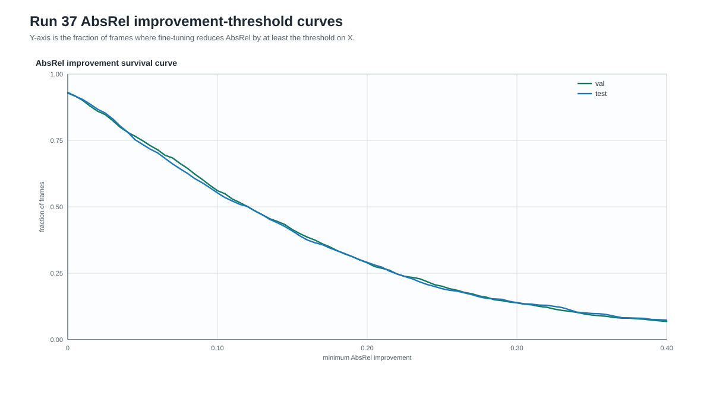
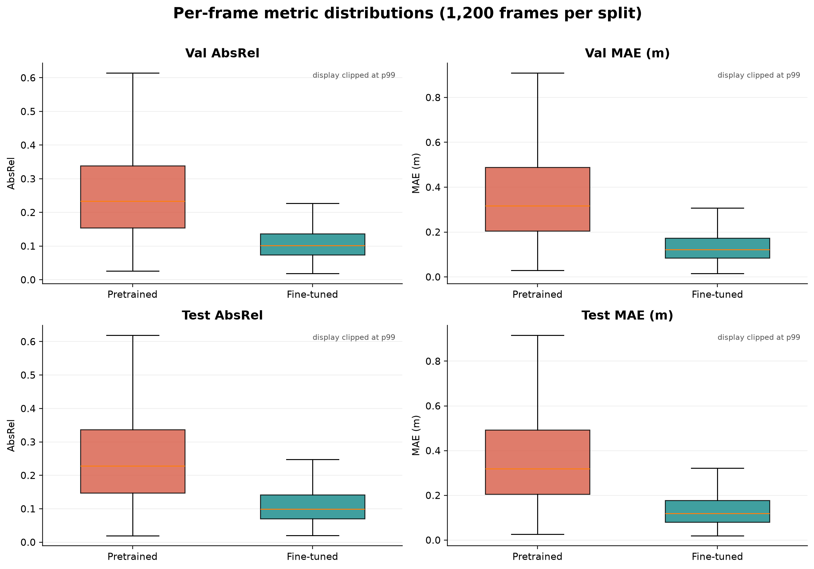
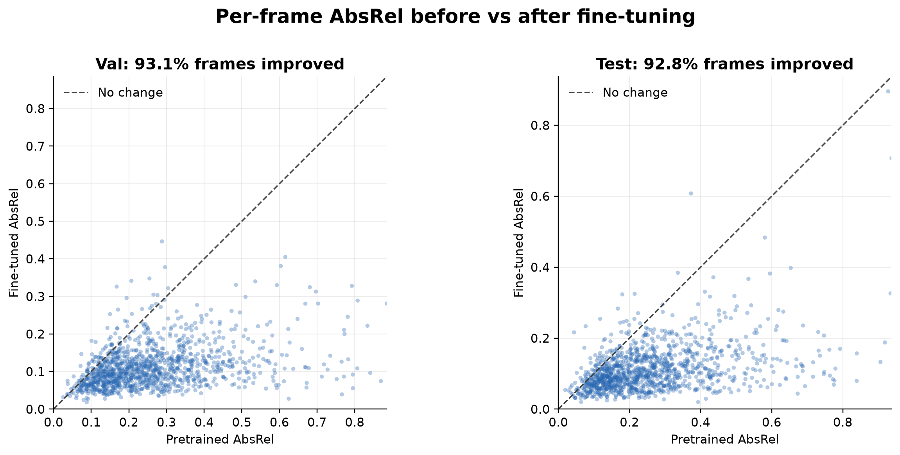

# Run 37 Training and Evaluation Plots

Run 37 fine-tunes
`depth-anything/Depth-Anything-V2-Metric-Indoor-Small-hf` on the Kaggle
ScanNet-style RGB-D frame pool.

## Training Setup

| Stage | Scenes | Frames seen | Epochs | Mini-batch steps | Mean train loss | Runtime |
| --- | ---: | ---: | ---: | ---: | ---: | ---: |
| Controlled train split | 1,210 | 198,862 | 1 | 99,431 | 0.0850 | 4.01 h |
| Full-data deployment | 1,513 | 248,402 | 1 | 124,201 | 0.0718 | 4.08 h |

The run used batch size 2 and gradient accumulation over 8 mini-batches. Since
there is only one epoch per stage, the output does not support a conventional
multi-epoch learning curve. The training overview therefore reports the
epoch-level loss and workload. The deployment loss is not directly comparable
to the controlled loss because it continues from the controlled checkpoint and
uses a different data pool.

## Held-Out Evaluation

All evaluation figures use `controlled_best`, not the
`full_dataset_deployment` checkpoint. Validation and test each contain 1,200
sampled frames from held-out scenes.

| Split | Model | AbsRel | RMSE (m) | MAE (m) | delta1 | delta2 | delta3 |
| --- | --- | ---: | ---: | ---: | ---: | ---: | ---: |
| Validation | Pretrained baseline | 0.2730 | 0.4778 | 0.3839 | 0.6441 | 0.8973 | 0.9602 |
| Validation | Fine-tuned `controlled_best` | **0.1145** | **0.2393** | **0.1431** | **0.9355** | **0.9805** | **0.9893** |
| Test | Pretrained baseline | 0.2707 | 0.4806 | 0.3850 | 0.6486 | 0.8994 | 0.9663 |
| Test | Fine-tuned `controlled_best` | **0.1140** | **0.2370** | **0.1428** | **0.9362** | **0.9807** | **0.9896** |

On validation, fine-tuning reduces AbsRel by 58.1%, RMSE by 49.9%, and MAE by
62.7%; delta1 increases by 29.1 percentage points. On test, it reduces AbsRel
by 57.9%, RMSE by 50.7%, and MAE by 62.9%; delta1 increases by 28.8 percentage
points.

## Evaluation Curves

Run 37 does not have a real training-loss curve over epochs or optimizer steps
in the exported artifacts: `training_history.csv` contains only one controlled
fine-tuning epoch summary. To avoid inventing a curve, the plots below show
evaluation curves from the available held-out per-frame metrics.

## Per-Frame Behavior

The box plots show that the improvement is not caused by only a few easy
frames. The full per-frame comparison finds lower AbsRel after fine-tuning on
93.1% of validation frames and 92.8% of test frames.

## Interpretation and Limits

The Run 37 depth-quality gate passes. The result supports using the fine-tuned
depth estimator in the next MV-DUSt3R+ predicted-depth correction experiment.
It does not yet prove that the final 3D reconstruction improves: that requires
running the reconstruction pipeline and evaluating its point-cloud metrics.

The `full_dataset_deployment` checkpoint was trained on all discovered
scenes/frames, including scenes belonging to the controlled validation/test
partition. It is a deployment artifact and must not be used as unbiased
held-out evidence. These results are also project-specific and are not an
official full ScanNet or ScanNet++ benchmark.
